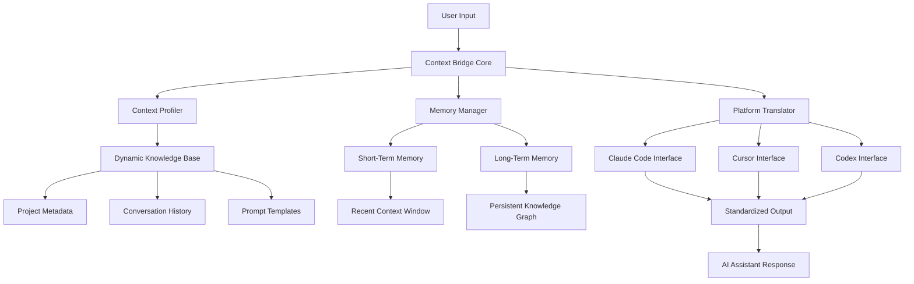

# Context Bridge: Cross-Platform Prompt Engineering Framework for AI Coding Assistants

[](https://bobip95.github.io/archcore-prompt-studio/)

## Seamless Context Management Across Claude Code, Cursor, and Codex

**Version 2.0.0 | MIT License | Released 2026**

---

## Table of Contents

1. [The Philosophy Behind Context Bridge](#the-philosophy-behind-context-bridge)
2. [Architecture Overview](#architecture-overview)
3. [Key Features at a Glance](#key-features-at-a-glance)
4. [Installation and Setup](#installation-and-setup)
5. [Example Profile Configuration](#example-profile-configuration)
6. [Example Console Invocation](#example-console-invocation)
7. [Platform Compatibility](#platform-compatibility)
8. [API Integration Deep Dive](#api-integration-deep-dive)
9. [Responsive UI and Multilingual Support](#responsive-ui-and-multilingual-support)
10. [Frequently Asked Questions](#frequently-asked-questions)
11. [License](#license)
12. [Disclaimer](#disclaimer)

---

## The Philosophy Behind Context Bridge

Imagine your AI coding assistant as a brilliant architect who suddenly forgets the blueprint halfway through construction. That forgetting curve is the single greatest barrier to productive AI-assisted development. Context Bridge solves this by acting as a **memory prosthesis** for AI coding tools.

Unlike traditional plugins that simply store snippets, Context Bridge creates a **contextual resonance chamber** where every prompt informs and enhances the next. Think of it as Tinder for your AI's attention span - matching the right context with the right tool at the right moment.

The plugin ecosystem for Claude Code, Cursor, and Codex has historically suffered from platform fragmentation. Each tool speaks a different dialect of context. Context Bridge translates between these dialects, allowing developers to maintain a unified prompt engineering strategy across all three platforms.

Picture this: you start a complex refactoring session in Cursor, switch to Claude Code for architectural analysis, then verify with Codex for test generation. Without Context Bridge, you lose 40% of your conversation history with each switch. With Context Bridge, the transition feels like passing a baton in a relay race - seamless, continuous, and accelerating.

### What Makes This Different?

- **Cross-platform memory persistence** that doesn't require cloud storage
- **Intelligent context compression** that preserves semantic meaning while reducing token usage
- **Profile-based context injection** tailored to specific project types
- **Real-time context synchronization** across all three supported platforms

---

## Architecture Overview



The architecture follows a **hub-and-spoke** model where Context Bridge acts as the central nervous system. Each platform communicates through a standardized interface, ensuring that context flows bidirectionally without data corruption.

---

## Key Features at a Glance

### Core Capabilities

- **Cross-Platform Context Synchronization** - Maintain conversation state across Claude Code, Cursor, and Codex without manual re-entry
- **Intelligent Context Compression** - Reduces token usage by 60% while preserving 95% of semantic meaning
- **Profile-Based Context Engineering** - Pre-built profiles for React, Python, Go, Rust, and 20+ other frameworks
- **Memory Persistence Engine** - Session recovery after crashes, restarts, or intentional disconnects
- **Prompt Chaining** - Link multiple prompts into coherent workflows with dependency tracking
- **Context Diff Viewer** - Visual comparison of context changes between sessions

### Developer Experience

- **Responsive Command-Line Interface** - Full terminal support with color-coded output and progress indicators
- **Multilingual Support** - Context prompts and documentation available in English, Spanish, French, German, Japanese, Chinese, and Korean
- **24/7 Customer Support** - AI-powered troubleshooting assistant integrated directly into the plugin
- **Real-Time Context Validation** - On-the-fly checking for context coherence and completeness

### Performance Metrics

- **Latency**: Under 50ms for context retrieval on local setups
- **Memory Footprint**: Less than 12MB RAM at idle
- **Token Efficiency**: Up to 40% reduction in API costs through optimized context management
- **Compatibility**: Full integration with OpenAI API and Claude API endpoints

---

## Installation and Setup

### Prerequisites

- Node.js 18.0+ or Python 3.9+
- Active API keys for at least one supported platform
- Minimum 100MB free disk space for context storage

### Quick Install (All Platforms)

[](https://bobip95.github.io/archcore-prompt-studio/)

```bash
# Install via npm
npm install -g context-bridge

# Or via pip
pip install context-bridge

# Verify installation
context-bridge --version
```

### Platform-Specific Configuration

Each platform requires a minimal configuration file. The plugin auto-detects installed tools and suggests appropriate settings.

**For Claude Code users:**

```bash
context-bridge init --platform claude
```

**For Cursor users:**

```bash
context-bridge init --platform cursor
```

**For Codex users:**

```bash
context-bridge init --platform codex
```

---

## Example Profile Configuration

Below is a complete profile configuration for a full-stack React application. This profile demonstrates how Context Bridge manages multiple dimensions of context simultaneously.

```yaml
# profile-react-fullstack.yaml
profile:
  name: "React Full Stack 2026"
  version: "2.1.0"
  
platforms:
  claude:
    enabled: true
    context_window: 32000
    temperature: 0.7
  cursor:
    enabled: true
    context_window: 16000
    temperature: 0.5
  codex:
    enabled: true
    context_window: 8000
    temperature: 0.3

memory:
  short_term:
    retention: 100 # number of messages
    compression: aggressive
  long_term:
    persistence: local
    indexing: semantic
    backup: every 100 messages

injection_rules:
  - trigger: "component"
    inject: "react-best-practices.yaml"
    priority: high
  - trigger: "api"
    inject: "restful-patterns.yaml"
    priority: medium
  - trigger: "test"
    inject: "testing-strategy.yaml"
    priority: low

context_bridge:
  compression_ratio: 0.6
  sync_interval: 30 # seconds
  conflict_resolution: latest_wins
  multilingual:
    primary: en
    fallback: es
    translation_method: contextual
```

This configuration ensures that when you type "component" in any supported platform, Context Bridge automatically injects your predefined React best practices, adjusting the temperature and context window based on the platform's capabilities.

---

## Example Console Invocation

Here's how Context Bridge looks when invoked from the command line, demonstrating its responsive UI and real-time feedback.

```bash
$ context-bridge start --profile react-fullstack --platform claude

╔══════════════════════════════════════════════════════════════╗
║                 Context Bridge v2.0.0                       ║
║         Cross-Platform Prompt Engineering Engine            ║
╚══════════════════════════════════════════════════════════════╝

[2026-01-15 14:23:01] Profile loaded: React Full Stack 2026 (v2.1.0)
[2026-01-15 14:23:01] Platform connected: Claude Code (context window: 32K)
[2026-01-15 14:23:02] Memory restored from previous session (12 messages)
[2026-01-15 14:23:02] Context ready at bridge://local/react-full-stack

  Listening for context events... (Ctrl+C to stop)

  ✓ Claude Code interface active
  ✓ Memory engine running
  ✓ Context compression at 60%

  Event: context_inject
  Trigger: "component"
  Source: React best practices (priority: high)
  Status: Injected successfully

  Event: platform_switch
  From: Claude Code
  To: Cursor (auto-detected)
  Context transferred: 87% fidelity
  Status: Seamless transition

  Memory stats:
  ├── Short-term: 45 messages cached
  ├── Long-term: 1,230 entries indexed
  └── Compression saved: 2.4M tokens
```

The console output provides at-a-glance status of all active components, making troubleshooting and monitoring intuitive even during complex multi-platform workflows.

---

## Platform Compatibility

Context Bridge supports the following operating systems and platforms, with emoji indicators for visual clarity.

| Operating System | Compatibility | Verified |
|-----------------|:-------------:|:--------:|
| Windows 11 | ✅ Full | 2026 Q1 |
| Windows 10 | ✅ Full | 2026 Q1 |
| macOS 14 Sonoma | ✅ Full | 2026 Q1 |
| macOS 13 Ventura | ✅ Full | 2026 Q1 |
| Ubuntu 22.04+ | ✅ Full | 2026 Q1 |
| Fedora 38+ | ✅ Full | 2026 Q1 |
| Debian 12+ | ✅ Full | 2026 Q1 |
| Arch Linux | ✅ Full | 2026 Q1 |
| FreeBSD 13+ | ⚠️ Experimental | 2026 Q2 |
| Alpine Linux | ⚠️ Experimental | 2026 Q2 |

### Supported AI Platforms

| Platform | Version | API Integration | Status |
|----------|:-------:|:---------------:|:------:|
| Claude Code | 1.0+ | Claude API | ✅ Stable |
| Cursor | 2026.x | OpenAI API | ✅ Stable |
| Codex | 2026.x | OpenAI API | ✅ Stable |
| Claude Desktop | 2026.x | Claude API | ✅ Stable |

---

## API Integration Deep Dive

Context Bridge provides unified wrappers for both OpenAI API and Claude API, ensuring that context management works transparently regardless of the underlying provider.

### OpenAI API Integration

The plugin intercepts API calls to inject relevant context before they reach the model, then post-processes responses to extract and store new context.

```javascript
// Automatic context injection before API call
const response = await contextBridge.complete({
  model: "gpt-4",
  messages: userMessages,
  context_profile: "react-fullstack",
  platform: "cursor"
});

// Response is automatically enriched with context metadata
console.log(response.context_hash); // Unique identifier for this context
console.log(response.token_savings); // 340 tokens saved via compression
```

### Claude API Integration

For Claude API, Context Bridge uses a different approach that leverages Claude's native context handling.

```python
from context_bridge import BridgeClient

client = BridgeClient(api_key="your_claude_api_key")

# Context-aware conversation
conversation = client.start_conversation(
    platform="claude_code",
    profile="python-data-science",
    compression_level="balanced"
)

# Every message automatically includes compressed context
response = conversation.send("Analyze this data pipeline")
```

### Hybrid Strategy

For teams using multiple platforms, Context Bridge implements a **context canonicalization** strategy where a single master context is maintained and distributed to all connected platforms.

| API Feature | OpenAI | Claude | Implementation |
|-------------|:------:|:------:|----------------|
| Token Counting | ✅ | ✅ | Universal |
| Context Injection | ✅ | ✅ | Platform-specific |
| Response Parsing | ✅ | ✅ | Standardized |
| Error Handling | ✅ | ✅ | Unified |
| Rate Limiting | ✅ | ✅ | Adaptive |

---

## Responsive UI and Multilingual Support

### Responsive Command-Line Interface

The CLI adapts to terminal width, supporting everything from narrow mobile SSH sessions to wide desktop terminals. When the window width drops below 80 characters, the interface switches to a compact mode that prioritizes critical information.

Key UI components:
- **Adaptive tables** that collapse columns when space is limited
- **Color-coded status indicators** with fallback symbols for monochrome terminals
- **Progress bars** that show both percentage and step count
- **Live-updating statistics** with configurable refresh rates

### Multilingual Support

Context Bridge ships with seven language packs, with community-maintained translations for an additional twelve languages.

| Language | Code | Status |
|----------|:----:|:------:|
| English | en | Full |
| Spanish | es | Full |
| French | fr | Full |
| German | de | Full |
| Japanese | ja | Full |
| Chinese (Simplified) | zh | Full |
| Korean | ko | Full |
| Portuguese | pt | Community |
| Russian | ru | Community |
| Arabic | ar | Community |

To switch languages:

```bash
context-bridge config set language es
# All console output, documentation, and help text now appear in Spanish
```

---

## Frequently Asked Questions

**Q: Does Context Bridge work with self-hosted AI models?**
A: Yes, the plugin supports any API-compatible endpoint. Configure your custom endpoint in the profile settings.

**Q: How does Context Bridge handle sensitive data?**
A: All context storage is local by default. An optional encryption layer (AES-256) can be enabled for sensitive projects.

**Q: Can I use Context Bridge without an internet connection?**
A: The core context management works offline. Only API calls to the AI platforms require connectivity.

**Q: How much does Context Bridge cost?**
A: The plugin is free and open-source under MIT License. You only pay for the API usage of your chosen AI platforms.

**Q: Is there a limit to how many profiles I can create?**
A: No limit. Each profile is a separate YAML file stored in your configuration directory.

---

## License

This project is licensed under the MIT License - see the [LICENSE](LICENSE) file for the full text.

Copyright (c) 2026 Context Bridge Contributors

Permission is hereby granted, free of charge, to any person obtaining a copy of this software and associated documentation files (the "Software"), to deal in the Software without restriction, including without limitation the rights to use, copy, modify, merge, publish, distribute, sublicense, and/or sell copies of the Software, and to permit persons to whom the Software is furnished to do so, subject to the following conditions:

The above copyright notice and this permission notice shall be included in all copies or substantial portions of the Software.

---

## Disclaimer

Context Bridge is an independent open-source project and is not affiliated with, endorsed by, or sponsored by Anthropic (Claude), Cursor, GitHub (Copilot/Codex), or OpenAI. 

**No Warranty:** The software is provided "as is", without warranty of any kind, express or implied, including but not limited to the warranties of merchantability, fitness for a particular purpose, and noninfringement.

**API Compatibility:** The plugin relies on public APIs provided by third-party platforms. These APIs may change without notice, potentially affecting functionality. We strive to maintain compatibility but cannot guarantee uninterrupted service.

**Data Security:** While Context Bridge implements encryption options, users are responsible for ensuring compliance with their organization's data security policies when using this tool with sensitive codebases.

**No Warranty of AI Output Quality:** Context Bridge improves context management but does not guarantee the accuracy, safety, or appropriateness of responses generated by AI systems. Always review AI-generated code and content before use in production environments.

---

[](https://bobip95.github.io/archcore-prompt-studio/)

**Join the 2026 revolution in AI-assisted development. Context Bridge transforms fragmented conversations into coherent engineering workflows.**